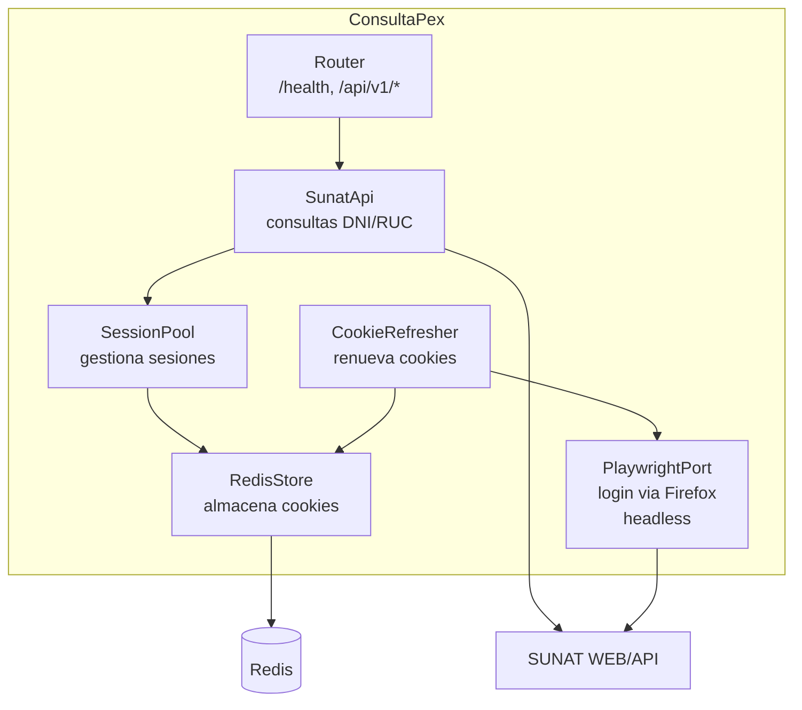

# ConsultaPex

API REST para consultar información de contribuyentes en SUNAT (DNI y RUC).

## Motivación

Para mi sistema de facturación electrónica necesitaba obtener nombres de personas y empresas, además de sus domicilios fiscales, a partir de su número de documento (DNI o RUC).

Las APIs de terceros ofrecían más información de la que necesitaba y requerían pago o tenían límites. La alternativa open source [peru-consult-api](https://github.com/giansalex/peru-consult-api) funcionaba parcialmente, pero la consulta de DNI dejó de funcionar hace un tiempo.

Como mi sistema ya usa credenciales SOL para facturar, decidí aprovecharlas para consultar directamente la web de SUNAT, manteniendo sesiones autenticadas para respuestas rápidas. El resultado es una API simple que devuelve exactamente lo necesario para facturar, sin dependencias externas de pago.

Este proyecto nació con la intención de aprovechar lo que encontré disponible y de paso aprender un poco de Elixir. No pretende ser la mejor solución para todos los casos.

## Alternativas

Antes de usar este proyecto, considera estas alternativas:

- **Solo necesitas RUC:** [peru-consult-api](https://github.com/giansalex/peru-consult-api) hace scraping de la [página pública de SUNAT](https://e-consultaruc.sunat.gob.pe/cl-ti-itmrconsruc/FrameCriterioBusquedaWeb.jsp) y no requiere credenciales SOL. Retorna más información que esta API.

- **Solo necesitas DNI:** Existen APIs con free tier o puedes hacer scraping de otros sitios públicos.

- **Necesitas alta concurrencia:** Considera una API de terceros de pago que esté optimizada para ese caso de uso.

## Requisitos

- Elixir 1.18+
- Node.js 18+
- Redis
- Credenciales SOL de SUNAT (RUC, Usuario, Clave)

## Configuración

Crea un archivo `.env` basado en `.env.example`:

```bash
cp .env.example .env
```

> **Tip:** Para desarrollo local puedes usar [direnv](https://direnv.net/) con un archivo `.envrc` que exporte las variables automáticamente al entrar al directorio.

Variables de entorno:

| Variable           | Requerida | Descripción                          | Default                  |
| ------------------ | --------- | ------------------------------------ | ------------------------ |
| `RUC`              | Sí        | RUC de la cuenta SUNAT               | -                        |
| `USUARIO_SOL`      | Sí        | Usuario SOL                          | -                        |
| `CLAVE_SOL`        | Sí        | Clave SOL                            | -                        |
| `API_KEY`          | Sí        | API key para autenticación           | -                        |
| `REDIS_URL`        | No        | URL de conexión a Redis              | `redis://localhost:6379` |
| `PORT`             | No        | Puerto HTTP del servidor             | `4000`                   |
| `POOL_SIZE`        | No        | Número de sesiones concurrentes      | `2`                      |
| `REFRESH_INTERVAL` | No        | Intervalo de refresh de cookies (ms) | `3600000` (1 hora)       |
| `RETRY_INTERVAL`   | No        | Intervalo de reintento si falla (ms) | `300000` (5 min)         |

## Ejecución

### Con Docker (recomendado)

**Producción:**

```bash
docker compose up --build
```

**Desarrollo (con hot-reload):**

```bash
docker compose -f docker-compose.dev.yml up --build
```

### Local (sin Docker)

```bash
# Instalar dependencias
mix deps.get
cd priv/playwright && npm ci && npm run build && cd ../..

# Instalar Firefox para Playwright
cd priv/playwright && npx playwright install firefox && cd ../..

# Iniciar Redis
redis-server

# Ejecutar
source .env && mix run --no-halt
```

## API

### Autenticación

Todos los endpoints (excepto `/health`) requieren el header `X-API-Key`:

```bash
curl -H "X-API-Key: tu-api-key" http://localhost:4000/api/v1/dni/12345678
```

### Endpoints

#### Health Check

```
GET /health
```

Respuesta:

```json
{ "status": "ok" }
```

#### Consultar por DNI

```
GET /api/v1/dni/:numero
```

Respuesta:

```json
{
  "success": true,
  "nombre": "NOMBRES APELLIDOS"
}
```

#### Consultar por RUC

```
GET /api/v1/ruc/:numero
```

Respuesta:

```json
{
  "success": true,
  "razon_social": "EMPRESA S.A.C.",
  "domicilios": [
    {
      "cod_estab": "0",
      "codigo": "1",
      "domicilio": "AV. EJEMPLO 123 LIMA-LIMA-LIMA",
      "tipo": "DOMICILIO FISCAL",
      "ubigeo": "150101",
      "uid": "1"
    },
    {
      "cod_estab": "1",
      "codigo": "2",
      "domicilio": "JR. SECUNDARIO 456 LIMA-LIMA-MIRAFLORES",
      "tipo": "ESTABLECIMIENTO ANEXO",
      "ubigeo": "150122",
      "uid": "2"
    }
  ]
}
```

> **Nota:** Al usar esta api SUNAT no permite consultar datos del propio RUC con el que se autenticó la sesión. Esto es porque estamos usando las cookies de la emisión de boletas y el RUC del adquiriente no puede ser igual que RUC del emisor.

#### Estado del Pool

```
GET /api/v1/pool/status
```

Respuesta:

```json
{
  "pool": {
    "size": 2,
    "available": 2,
    "in_use": 0,
    "waiting": 0
  },
  "sessions": {
    "ready": 2,
    "oldest_update": "2025-12-29T10:30:00Z"
  }
}
```

### Errores

| Código | Descripción                                  |
| ------ | -------------------------------------------- |
| 400    | Error en la consulta (DNI/RUC inválido)      |
| 401    | API key faltante o inválida                  |
| 404    | Ruta no encontrada                           |
| 503    | Servicio no disponible (sin sesiones listas) |

## Arquitectura

### Pool de Sesiones

Para obtener la razón social y domicilios de un RUC se requieren dos llamadas separadas a SUNAT: una para validar el RUC (que retorna la razón social) y otra para obtener los domicilios. El problema es que SUNAT mantiene estado del lado del servidor entre estas consultas: al validar un RUC, el servidor guarda internamente cuál fue el último RUC consultado en la sesión, y la consulta de domicilios retorna los domicilios de ese RUC.

Esto podría causar race conditions con consultas concurrentes: al consultar un RUC podrías terminar devolviendo los domicilios de otro.

La solución es un pool de N sesiones independientes. Cada request de RUC hace checkout de una sesión, la usa exclusivamente, y la devuelve al pool.



### Consideraciones

Para autenticarse en SUNAT y obtener las cookies de sesión se requiere un navegador headless (Firefox via Playwright). Esto implica levantar un proceso de Node.js con un navegador, lo cual no es ligero en términos de recursos.

Sin embargo, el navegador solo se usa para el login inicial y para refrescar las cookies periódicamente (por defecto cada hora). Las consultas a la API de SUNAT se hacen con HTTP simple usando las cookies almacenadas en Redis.

Para sistemas que no requieren demasiadas conexiones concurrentes, este overhead es tolerable. Si necesitas alta concurrencia, considera usar una API de terceros de pago. Esta es mi opción gratuita con lo que pude encontrar disponible.

## Estructura del Proyecto

```
consulta_pex/
├── lib/consulta_pex/
│   ├── application.ex      # Supervisor principal
│   ├── router.ex           # Router principal
│   ├── router/
│   │   ├── api.ex          # Router /api
│   │   └── v1.ex           # Router /api/v1
│   ├── plugs/
│   │   └── api_key_auth.ex # Autenticación
│   ├── session_pool.ex     # Pool de sesiones
│   ├── cookie_refresher.ex # Refresco automático
│   ├── playwright_port.ex  # Integración Node.js
│   ├── redis_store.ex      # Storage Redis
│   ├── sunat_api.ex        # Cliente SUNAT
│   └── sunat_endpoints.ex  # URLs centralizadas
├── priv/playwright/        # Script de login (Node.js)
├── config/
│   └── runtime.exs         # Configuración runtime
├── Dockerfile              # Producción
├── Dockerfile.dev          # Desarrollo
├── docker-compose.yml      # Producción
└── docker-compose.dev.yml  # Desarrollo
```

## Desarrollo

Acceder a IEx en desarrollo:

```bash
docker compose -f docker-compose.dev.yml exec app iex -S mix
```

Ver logs de Redis:

```bash
docker compose -f docker-compose.dev.yml exec redis redis-cli monitor
```

## Contribuir

Ver [CONTRIBUTING.md](CONTRIBUTING.md) para detalles sobre cómo contribuir al proyecto.

## Licencia

MIT
